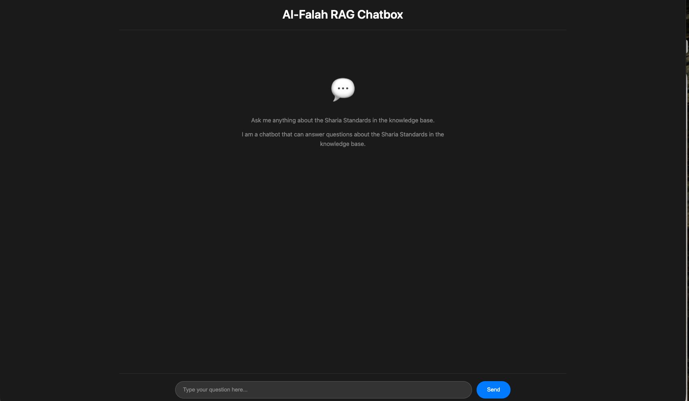
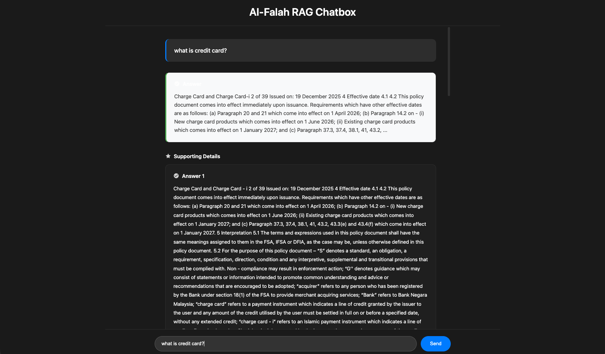

# Al-Falah RAG Chatbox

A Retrieval-Augmented Generation (RAG) chatbot that answers questions about Sharia Standards by searching through a knowledge base of documents using Vertex AI Vector Search and generating natural answers with Gemini AI.



*Welcome screen of the Al-Falah RAG Chatbox*

## What It Does

The Al-Falah RAG Chatbox is a proof-of-concept (POC) application that:

1. **Crawls and Processes Documents**: Extracts content from PDFs and web pages, processes them into searchable chunks
2. **Generates Embeddings**: Converts text chunks into vector embeddings using Vertex AI
3. **Stores in Vector Search**: Uploads vectors to Vertex AI Matching Engine for semantic search
4. **Answers Questions**: Uses natural language queries to find relevant information and generates natural answers
5. **Displays Results**: Shows natural answers, source chunks, PDF page screenshots, and source links



*Example query showing natural answer and supporting details*

## How It Works

### Architecture

```
┌─────────────────────────────────────────────────────────────┐
│                    User Query                                │
│              "What is a charge card?"                       │
└────────────────────┬────────────────────────────────────────┘
                     │
                     ▼
┌─────────────────────────────────────────────────────────────┐
│              Webapp (PHP Frontend)                           │
│              - Receives user question                        │
│              - Calls Python script                           │
└────────────────────┬────────────────────────────────────────┘
                     │
                     ▼
┌─────────────────────────────────────────────────────────────┐
│         Query Vertex AI (Python Script)                      │
│         1. Generate embedding for question                  │
│         2. Search vector index for similar chunks            │
│         3. Generate natural answer using Gemini               │
└────────────────────┬────────────────────────────────────────┘
                     │
                     ▼
┌─────────────────────────────────────────────────────────────┐
│              Vertex AI Vector Search                          │
│         - Finds top-k most similar chunks                    │
│         - Returns chunks with metadata                       │
└────────────────────┬────────────────────────────────────────┘
                     │
                     ▼
┌─────────────────────────────────────────────────────────────┐
│         Generate Natural Answer (Gemini)                     │
│         - Synthesizes information from chunks                │
│         - Creates conversational response                   │
└────────────────────┬────────────────────────────────────────┘
                     │
                     ▼
┌─────────────────────────────────────────────────────────────┐
│              Display Results                                  │
│         - Natural answer (prominently displayed)              │
│         - Supporting details (source chunks)                  │
│         - Screenshots (if PDF page available)                │
│         - Source links                                        │
└─────────────────────────────────────────────────────────────┘
```

### Complete Workflow

1. **Crawler** (`crawler/crawler.py`):
   - Reads sources from `crawler/resources/sources.json`
   - Extracts text from PDFs and web pages
   - Chunks text into smaller pieces (1000 chars with 200 char overlap)
   - Generates embeddings using Vertex AI (`text-embedding-005`)
   - Uploads vectors to Vertex AI Matching Engine

2. **Query** (`crawler/query_vertex.py`):
   - Takes user question as input
   - Generates embedding for the question
   - Searches vector index for similar chunks
   - Generates natural answer using Gemini AI
   - Returns answer + source chunks with metadata

3. **Webapp** (`webapp/index.php`):
   - Provides chat interface (frontend)
   - Handles API requests (backend)
   - Calls Python scripts to query Vertex AI
   - Generates PDF page screenshots
   - Displays results with natural answer, sources, and screenshots

## How to Activate

### Prerequisites

- **Python 3.9+** with pip
- **PHP 7.4+** with `shell_exec()` enabled
- **Google Cloud Project** with Vertex AI API enabled
- **Service Account** with Vertex AI permissions

### Step 1: Setup Crawler Environment

1. **Navigate to crawler directory**:
   ```bash
   cd crawler
   ```

2. **Install Python dependencies**:
   ```bash
   pip install -r requirements.txt
   ```

3. **Create `.env` file**:
   ```bash
   # Copy example if available, or create new
   touch .env
   ```

4. **Configure `.env` file**:
   ```bash
   # Vertex AI Configuration
   VERTEX_PROJECT_ID=your-project-id
   VERTEX_LOCATION=us-central1
   VERTEX_INDEX_ID=your-index-id
   VERTEX_INDEX_ENDPOINT=your-endpoint-id

   # Google Cloud Credentials
   GOOGLE_APPLICATION_CREDENTIALS=cred.json

   # GCS Bucket (for batch updates)
   GCS_BUCKET_NAME=your-bucket-name

   # Optional: Crawler Settings
   CHUNK_SIZE=1000
   CHUNK_OVERLAP=200
   ```

5. **Download Service Account Credentials**:
   - Go to [Google Cloud Console > IAM & Admin > Service Accounts](https://console.cloud.google.com/iam-admin/serviceaccounts)
   - Create a service account or use existing one
   - Create a JSON key and download it
   - Save it and or update path in `.env`

6. **Setup Vertex AI** (if not already done):
   - Follow instructions in `crawler/VERTEX_AI_SETUP.md`
   - Create Vector Search Index (768 dimensions)
   - Create Index Endpoint and deploy index
   - Get `VERTEX_INDEX_ID` and `VERTEX_INDEX_ENDPOINT` IDs

7. **Add sources to crawl**:
   - Edit `crawler/resources/sources.json`
   - Add PDFs, web pages, or local files to crawl
   - See `crawler/README.md` for source configuration examples

8. **Run crawler** (optional, if you need to populate the index):
   ```bash
   python3 crawler.py
   ```
   This will extract content, generate embeddings, and upload to Vertex AI.

### Step 2: Run PHP Server

1. **Navigate to webapp directory**:
   ```bash
   cd webapp
   ```

2. **Make Python scripts executable** (if needed):
   ```bash
   chmod +x ../crawler/query_vertex.py
   chmod +x ../crawler/screenshot_page.py
   ```

3. **Start PHP built-in server**:
   ```bash
   php -S localhost:8000
   ```

   **Alternative ports**:
   ```bash
   # Use port 8020
   php -S localhost:8020

   # Allow access from network
   php -S 0.0.0.0:8000
   ```

### Step 3: Access the Application

1. **Open in browser**:
   ```
   http://localhost:8000
   ```

2. **You should see**:
   - Welcome screen with "Al-Falah RAG Chatbox" title
   - Instructions: "Ask me anything about the Sharia Standards in the knowledge base"
   - Input field at the bottom: "Type your question here..."
   - Send button

3. **Try a query**:
   - Type a question like: "What is a charge card?"
   - Click "Send"
   - Wait for the response

4. **Expected results**:
   - Natural answer displayed prominently (green-bordered box)
   - Supporting details section with source chunks
   - Screenshots of PDF pages (if available)
   - Source links with page numbers

## Project Structure

```
falah/
├── README.md              # This file
├── ss1.png                # Screenshot: Initial interface
├── ss2.png                # Screenshot: Query results
│
├── crawler/               # Python crawler and vector search
│   ├── crawler.py         # Main crawler (extract → chunk → embed → upload)
│   ├── query_vertex.py    # Query Vertex AI vector search
│   ├── screenshot_page.py # Generate PDF page screenshots
│   ├── config.py          # Configuration (loads from .env)
│   ├── utils.py           # Utility functions
│   ├── requirements.txt   # Python dependencies
│   ├── .env               # Environment variables (create this)
│   ├── resources/         # Source files
│   │   ├── sources.json   # Sources to crawl
│   │   └── data/          # Local PDF files
│   ├── output/            # Generated files
│   │   ├── chunks.json    # Extracted chunks
│   │   ├── screenshots/   # PDF page screenshots
│   │   └── crawler.log    # Execution log
│   └── README.md          # Crawler documentation
│
└── webapp/                # PHP web application
    ├── index.php          # Main file (backend + frontend)
    ├── .htaccess          # Apache configuration
    └── README.md          # Webapp documentation
```

## Quick Start Summary

```bash
# 1. Setup crawler
cd crawler
pip install -r requirements.txt
# Create .env file with your Vertex AI configuration


# 2. (Optional) Populate vector index
python3 crawler.py

# 3. Start webapp
cd ../webapp
php -S localhost:8000

# 4. Access in browser
# Open http://localhost:8000
```

## Features

- ✅ **Natural Language Queries**: Ask questions in plain English
- ✅ **Natural Answers**: Gemini AI synthesizes information into conversational responses
- ✅ **Source Citations**: See where information comes from
- ✅ **PDF Screenshots**: Visual preview of source documents
- ✅ **Semantic Search**: Finds relevant information even with different wording
- ✅ **Responsive Design**: Works on desktop and mobile

## Documentation

- **Crawler**: See `crawler/README.md` for detailed crawler documentation
- **Webapp**: See `webapp/README.md` for webapp setup and usage
- **Vertex AI Setup**: See `crawler/VERTEX_AI_SETUP.md` for Vertex AI configuration
- **Workflow**: See `crawler/WORKFLOW_SUMMARY.md` for complete workflow details
- **Troubleshooting**: See `crawler/TROUBLESHOOTING.md` for common issues

## Requirements

### Crawler
- Python 3.9+
- Google Cloud Project with Vertex AI API enabled
- Service Account with Vertex AI permissions
- See `crawler/requirements.txt` for Python packages

### Webapp
- PHP 7.4+ with `shell_exec()` enabled
- Python 3 (for calling crawler scripts)
- Web server (PHP built-in server, Apache, or Nginx)

## License

[Your License Here]
